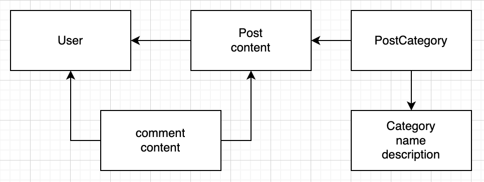

# Rails 7 blog

## Description

This is a personal proof of concept for building a Rails app including some useful libraries

## Technologies
- Rails 7
- Ruby 3.2
- Docker
- Devise + Onminauth Google
- Sqlite
- Blazer

## Model

## Change log
- Omniauth google
- Setup models
- Setup devise https://github.com/heartcombo/devise
- Initial setup `rails new rails7blog`

## TODO
- Docker
- Blazer

## Contact
- https://www.linkedin.com/in/agust%C3%ADn-young-bertassi-a43b5b6b/